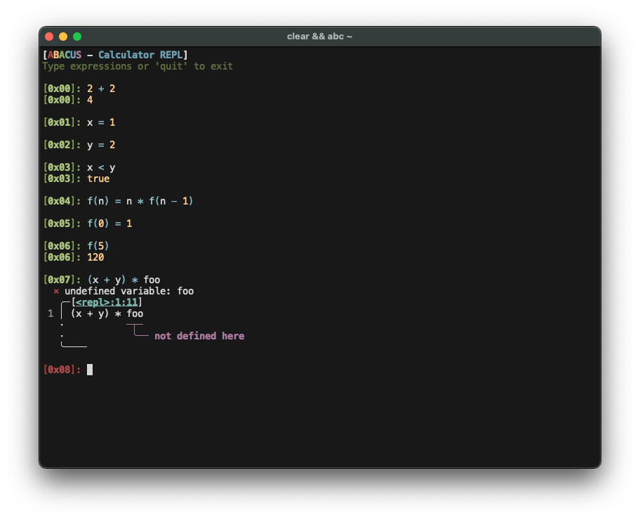

# Abacus


[](https://docs.rs/abacus)

Abacus is a experimental, interpreted functional programming language with a pleasant REPL

## Highlights

- Persistent REPL environment with history and an ANSI-colored prompt.
- 64-bit integers, double-precision floats, and booleans with straightforward formatting.
- Arithmetic, comparison, logical, and bitwise operators with predictable precedence.
- Pattern-matched function arms: mix literals and identifiers and the most specific match runs.
- Helpful diagnostics that underline exactly where evaluation failed.




## Install

### Cargo

```bash
cargo install abacus
```


## Try It

### Usage

```
The Abacus calculator REPL and runner

Usage: abc [OPTIONS] [FILE]

Arguments:
  [FILE]  Execute the given Abacus source file

Options:
  -e, --expr <EXPR>  Evaluate a single expression and exit
  -n, --no-color     Disable ANSI color output
  -h, --help         Print help
  -V, --version      Print version
```

- Start the interactive REPL: `abc`
- Evaluate a single expression and print the result: `abc -e "2 + 2"`
- Execute a source file (runs each line in order, sharing the same environment): `abc path/to/program.abc`
- Disable ANSI colors for scripts or terminals that do not support them: add `--no-color` (e.g. `abc --no-color -e "1/3"`)
- Color is also controlled by common environment variables: `NO_COLOR` disables color, `CLICOLOR_FORCE=1` forces it, and `CLICOLOR=0` disables it unless forced. Color is off when stdout is not a TTY unless forced.
- Equality is type-strict: ints and floats cross-compare, but comparing booleans to numbers raises a type error instead of silently returning `false`.
- Function calls have a recursion safeguard (default limit 1000, configurable via `--recursion-limit` or `ABACUS_MAX_CALL_DEPTH`); unbounded recursion (e.g., `inf(n) = n * inf(n)`) will eventually raise a recursion-limit diagnostic instead of looping forever.

REPL sessions retain history, coloring, and diagnostic output between entries:

```text
[0x00]: rate = 0.0825
[0x01]: with_tax(amount) = amount * (1 + rate)
[0x02]: with_tax(24.99)
[0x02]: 27.05475
[0x03]: fib(0) = 0
[0x04]: fib(1) = 1
[0x05]: fib(n) = fib(n-1) + fib(n-2)
[0x06]: fib(10)
[0x06]: 55
[0x07]: odd(n) = n % 2 == 1
[0x08]: odd(41)
[0x08]: true
```

## Build From Source

```bash
cargo build
```

## Limitations

- Mixed integer and float arithmetic promotes integers to floats. Integers outside the range 2^53 may lose precision in the conversion.

## License

This project is licensed under the [MIT License](./LICENSE.md).
